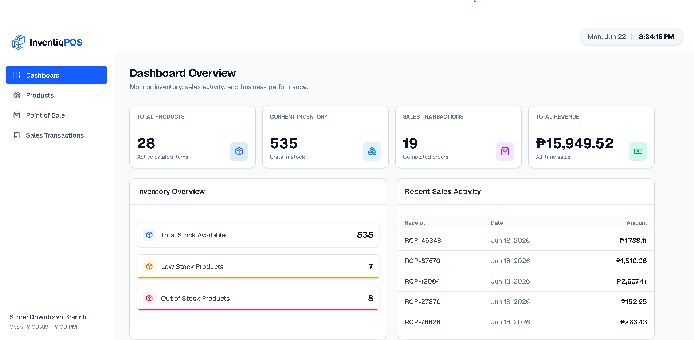
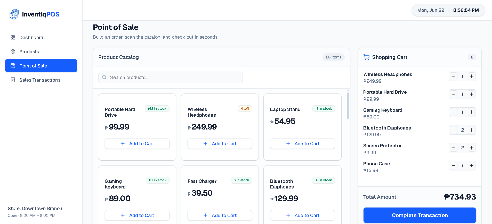
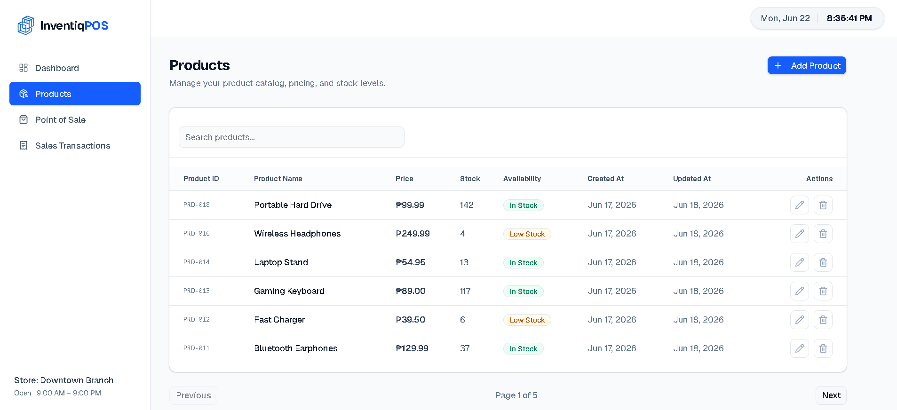
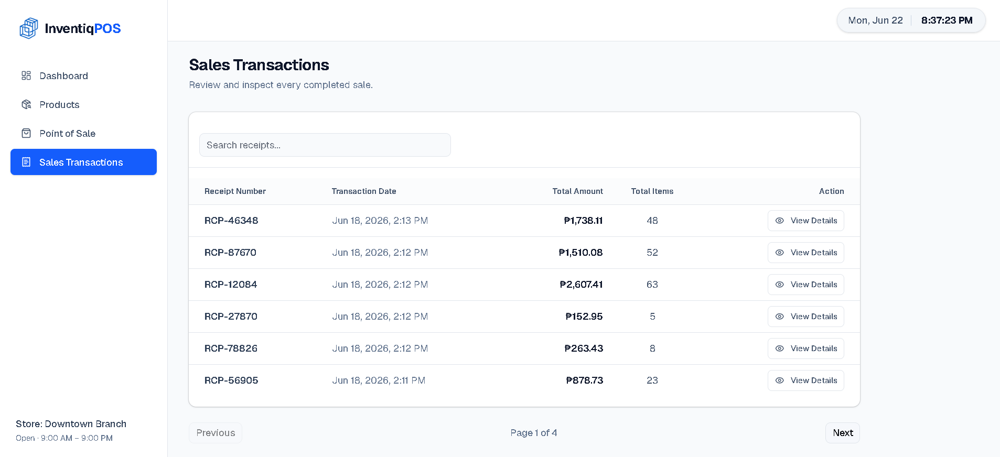

<div align="center">
  <h1>🛍️ Inventiq POS & Inventory System</h1>
  <p>A fast, modern, and beautiful Point of Sale and Inventory Management application.</p>

  <!-- Badges -->
  <p>
    
    
    
    
    
    
  </p>

  <h3><a href="https://inventiq-tan.vercel.app/">🌐 View Live Demo</a></h3>
</div>

---

## 📸 Screenshots

| Dashboard | Point of Sale |
|:---:|:---:|
|  |  |
| **Products** | **Sales Transactions** |
|  |  |

## 📌 Overview

**Inventiq** is a streamlined Point of Sale (POS) and Inventory Management system tailored for small-to-medium retail environments. It provides a lightning-fast, ultra-modern interface to process sales, manage stock quantities, and view real-time analytics without the clutter of unnecessary features.

This project was built adhering to strict, minimal-scope documentation, guaranteeing a robust, focused, and high-performance workflow.

## ✨ Key Features

- **📦 Inventory Management:** Easily add, edit, delete, and view products. Includes real-time stock tracking and dynamic low-stock alerts.
- **🛒 Point of Sale (POS):** A sleek catalog and cart interface for building orders. Auto-calculates totals and generates clean, professional digital receipts.
- **📈 Sales Transactions:** Track historical sales data, inspect individual receipt details in a beautiful modal, and monitor shop activity.
- **📊 Interactive Dashboard:** Get a bird's-eye view of your business with metrics on total revenue, active products, and low-stock warnings.

## ✅ Features Checklist

### Inventory Management
- [x] Add product
- [x] View products
- [x] Edit products
- [x] Delete products
- [x] Track stock quantity
- [x] Display product price
- [x] Display stock availability

### POS Module
- [x] View available products
- [x] Add products to cart
- [x] Update quantities
- [x] Remove cart items
- [x] Calculate totals
- [x] Complete transactions

### Sales Module
- [x] Generate receipt number
- [x] Save sales transactions
- [x] Save sales details
- [x] Deduct inventory quantity

### Dashboard
- [x] Total number of products
- [x] Current inventory levels
- [x] Total sales transactions
- [x] Recent sales activity
- [x] Total revenue

## 🚀 Installation Guide

> **Note for Beginners:** You will need to open **two separate terminal windows** to run this project—one for the backend server and one for the frontend client.

### Prerequisites
Before you begin, ensure you have the following installed on your machine:
- **Node.js** (v18 or higher recommended)
- **Local Server Environment** (XAMPP, WAMP, or similar) for MySQL database
- **Git** (optional, for cloning the repository)

### 1. Database Import Steps
1. Start your local server environment (e.g., XAMPP or WAMP) and ensure the **MySQL** module is running.
2. Open your database management tool (e.g., phpMyAdmin, usually at `http://localhost/phpmyadmin`).
3. Create a new database named `inventiq`.
4. Go to the **Import** tab and upload the `database.sql` script found in the `server/src/database/` directory.
5. Click **Import** to construct the necessary tables.

### 2. Start the Backend (Terminal 1)
Open your first terminal window and run:
```bash
cd server
npm install

# Set up your environment variables
# Copy the example file and rename it to .env
cp .env.example .env
# Open .env and ensure your MySQL username, password and DB name are correct

npm run dev
```

### 3. Start the Frontend (Terminal 2)
Leave the first terminal running, open a **new, second terminal window**, and run:
```bash
cd client
npm install

# Set up your environment variables
# Copy the example file and rename it to .env
cp .env.example .env

npm run dev
```
Navigate to `http://localhost:5173` in your browser to view the application!

## 🛠️ Technology Stack

### Frontend (`/client`)
- **Framework:** React + Vite
- **Language:** TypeScript
- **Styling:** Tailwind CSS + custom UI components
- **Routing:** React Router DOM
- **HTTP Client:** Axios

### Backend (`/server`)
- **Environment:** Node.js
- **Framework:** Express.js
- **Language:** TypeScript
- **Database:** MySQL (WAMP Server compatible)

## ☁️ Deployment Architecture

This project is deployed across distinct environments to ensure optimal performance, security, and scalability:

- **Frontend (Client):** Deployed on **Vercel** ([Live Demo](https://inventiq-pos.vercel.app/)).
  - *Purpose:* Vercel provides a global Content Delivery Network (CDN), ensuring the React application loads blazingly fast for users regardless of their location.
- **Backend (Server):** Deployed on **Render**.
  - *Purpose:* Render provides a reliable, persistent runtime environment for the Node.js/Express server to handle API requests, process business logic, and manage secure connections to the database.
- **Database:** Hosted on **TiDB Cloud Serverless**.
  - *Purpose:* TiDB Cloud Serverless offers a scalable, highly available MySQL-compatible database ensuring secure data storage and automated backups, separated from the application logic.

## 📂 Project Structure

```text
Inventiq/
├── client/          # React + Vite frontend application
├── server/          # Node.js + Express backend API
└── docs/            # Strict project guidelines and documentation
```

## 📖 Documentation
For the absolute source of truth regarding database schemas, feature requirements, and UI guidelines, please refer exclusively to the `/docs` directory. No features fall outside the bounds of these strict guidelines.

---
<div align="center">
  <i>Designed with modern aesthetics and strict operational rules in mind.</i>
</div>
